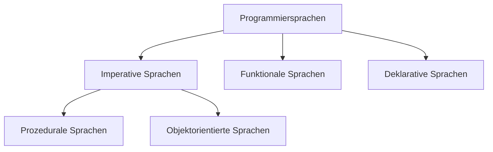

# Python

## Allgemeine Syntax
## Einordnung und Abgrenzung

### Unterschiede zu Javascript und Java 


| Aspekt               | Python              | Javascript         | Java                      |
| -------------------- | ------------------- | ------------------ | ------------------------- |
| Typsystem            | Dynamisch Strikt    | Dynamisch schwach  | Statisch+Dynamisch Strikt |
| Immutable            | Ja                  | nein               | möglich                   |
| Numerische Typen     | int, float, decimal | number             | int, long, double ...     |
| # Funktionsargumente | strikt              | flexibel           | strikt                    |
| Geordnete Daten      | List, Tupel         | Array              | Array, List               |
| Properties           | Descriptor Protocol | `get`-Syntax       | manuell                   |
| Module               | Batteries Included  | Frameworks         | Batteries Included        |
| Objektorientierung   | möglich             | möglich            | forciert                  |
|                      |                     |                    |                           |
| Syntax               |                     |                    |                           |
| Blöcke               | Einrückung          | {}                 | {}                        |
| Befehlsende          | Zeilenende          | ; (automatisch)    | ;                         |
|                      |                     |                    |                           |
| Einsatz              |                     |                    |                           |
| Geschwindigkeit      | Langsam (Cpython)   | Schnell (Node)     | Schnell                   |
| Vorinstalliert       | außer auf Windows   | Im Browser         | Auf Android               |
| Web-Einsatz          | Backend             | Frondend + Backend | Backend                   |
| Scientific Computing | Ja (Numpy)          | Nein               | Nein                      |
|                      |                     |                    |                           |


Python ist hacky und trotzdem schön


Python kann sowohl prozedural als auch objektorientiert verwendet werden und enthält viele Aspekte der Funktionalen und Deklarativen Programmierung. 

> The reason it has been so successful with Data Processing and Machine Learning tasks is that many of the libraries have adopted API's where you declare the operations you want to perform, and the library executes those declarations in an efficient manner in a lower level language. This leads to the best of both worlds, code thats easy to write in Python that runs as fast as code written in C++.
> (https://www.benfrederickson.com/python-as-a-declarative-programming-language/)

## Dateien öffnen
```python
f = open("demofile2.txt", "a")
f.write("Now the file has more content!")
f.close()

#open and read the file after the appending:
f = open("demofile2.txt", "r")
print(f.read())
```
## Module
### Module nutzen am Beispiel von 


## Quellen
Vertleich von Python und Javascript: https://www.educba.com/python-vs-javascript/
