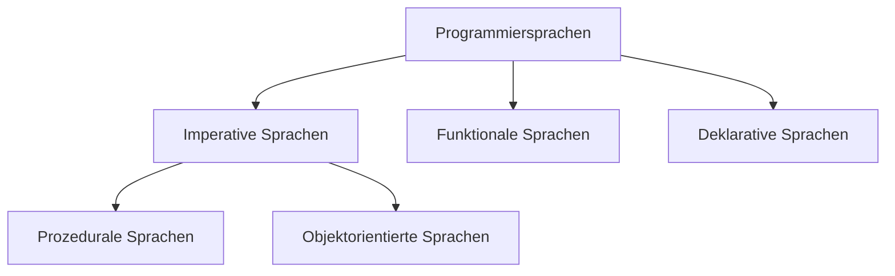

<style>
h2 { color: #080; }
h4 { color: #777; }

body {counter-reset: h1 h2 h3}
h1 {counter-reset: h2 h3}
h2 {counter-reset: h3}

h1:before {counter-increment: h1; content: counter(h1) "\0000a0\0000a0"}
h2:before {counter-increment: h2; content: counter(h1) "." counter(h2) "\0000a0\0000a0"}
h3:before {counter-increment: h3; content: counter(h1) "." counter(h2) "." counter(h3) "\0000a0\0000a0"}
</style>

# Python

## Erste Schritte

---

### Interactive

```powershell
python
```

Dort können wir unser ersten Programm `1+2` schreiben. Der Prompt kann mit `ctrl+D` bzw. `ctrl+Z Enter` unter Windows sowie dem Befehl exit() beendet werden.

### Direkt

```powershell
python -c "print('Hello World')"
```

---

### Skript ausführen

```powershell
python helloworld.py
```

## Allgemeine Syntax

---

### Rechenoperationen

Es gibt die Rechenoperatoren: `+`,  `-`,  `*`,  `/`,  `%` (Modulo),  `**`, (Potenz), `//` (Ganzzahldivision)

1. Was genau macht die Ganzzahldivision `//`?
2. Gilt die Regel Punkt vor Strich?
3. Was passiert, wenn Sie True zu einer Zahl addieren?
4. Was passiert, wenn Sie die Anzahl der Atome im Universum $10^{80}$ eingeben. Was würde bei Java oder Javascript passieren? Eine Vermutung genügt.
5. Prüfen Sie den Wert der Variablen `_`. Zu was dient sie?
6. Rechnen Sie `1.2 - 1.0 - 0.2` aus. Entspricht das Ergebnis Ihrer Erwartung?

---

### Variablen

In Python werden Variablen nicht explizit deklariert. Außerdem wird kein Typ angegeben. Eine Variable selbst hat auch keinen (statischen) Typ. Lediglich der Inhalt hat einen Typ. Der Typ, des Inhalts wird als dynamischer Typ der Variable bezeichnet.

Eine Zuweisung geschieht analog zu Java.

```
höhe = 100
breite = 80
höhe * breite
```

Der (dynamische) Typ einer Variable kann mit der Funktion `type()` geprüft werden.

---
### Strings

Strings werden mit `"text"`  oder `'text'` angegeben.

1. Schreiben Sie den String `doesn't`.

2. Notieren Sie den String  `He doesn't like a 20" bicycle`. Benutzen Sie dazu den Escape-Character der Ihnen aus Java bekannt ist.

3. Sie können mit dreifachen Anführungsstrichen einen String aus mehreren Zeilen erzeugen. Aber wozu ist der Backslash `\`? 
	```
   """\
    () ()
    ('.')
   (") (")
   """
   ```
   
4. Können Sie Strings auch mit Zahlen multiplizieren? Wozu könnte das sinnvoll sein?

5. Weisen Sie der Variablen `p` den String `Python`zu.

6. Extrahieren Sie den ersten Buchstaben eines Wortes wie folgt p[0]`. Welchen Typ hat ein Buchstabe in Python?

7. Geben Sie eine negative Zahl als Index an. Was passiert? Was würde in Java passieren? Welchen Vor- und Nachteil hat das Verhalten von Python gegenüber dem von Java?

8. Benutzen Sie die Funktion `len()` um die Länge eines Strings zu messen.

9. Wie funktioniert die Syntax p[1:3]`? Diese Syntax gibt es bei java nicht!

   1. Was fällt Ihnen bei der Angabe des Endes auf? Welchen Vorteil bietet es, dass das Element an der Stelle 3 ausgeschlossen wird
   2. Wie reagiert der Interpretern, wenn Sie die Zahlen aus Versehen Vertauschen. Nennen Sie einen Vorteil und einen Nachteil, gegenüber einer Fehlermeldung.
   3. Lassen Sie eine der beiden Zahlen weg. Was passiert dann?
   4. Kombinieren Sie die Konzepte von Aufgabe 7 und Aufgabe 9. Geben den String `p` vom zweiten bis zum vorletzten Buchstaben aus.

10. Versuchen Sie den ersten Buchstaben von `p` durch ein `C` zu ersetzen. Warum klappt das nicht? Entwickeln Sie einen Workaround.

### Listen und Tupel


## Einordnung und Abgrenzung

Python ist eine sehr flexible Sprache für Rapid Application Development. Viele würden sie als „schön“ bezeichnen.  

### Unterschiede von Python zu Javascript und Java 


| Aspekt               | Python              | Javascript         | Java                  |
| -------------------- | ------------------- | ------------------ | --------------------- |
| Typsystem            | Dynamisch Strikt    | Dynamisch schwach  | Statisch Strikt       |
| Immutable            | Ja                  | nein               | möglich               |
| Numerische Typen     | int, float, decimal | number             | int, long, double ... |
| Argumente            | strikt              | flexibel           | strikt                |
| Geordnete Daten      | List, Tupel         | Array              | Array, List           |
| Properties           | Descriptor Protocol | `get`-Syntax       | manuell               |
| Module               | Batteries Included  | Frameworks         | Batteries Included    |
| Objektorientierung   | möglich             | möglich            | forciert              |
|                      |                     |                    |                       |
| Blöcke               | Einrückung          | {}                 | {}                    |
| Befehlsende          | Zeilenende          | ; (automatisch)    | ;                     |
|                      |                     |                    |                       |
| Geschwindigkeit      | Langsam (Cpython)   | Schnell (Node)     | Schnell               |
| Vorinstalliert       | außer auf Windows   | Im Browser         | Auf Android           |
| Web-Einsatz          | Backend             | Frondend + Backend | Backend               |
| Scientific Computing | Ja (Numpy)          | Nein               | Nein                  |
|                      |                     |                    |                       |



Python kann sowohl prozedural als auch objektorientiert verwendet werden und enthält viele Aspekte der Funktionalen und Deklarativen Programmierung. 

> The reason it has been so successful with Data Processing and Machine Learning tasks is that many of the libraries have adopted API's where you declare the operations you want to perform, and the library executes those declarations in an efficient manner in a lower level language. This leads to the best of both worlds, code thats easy to write in Python that runs as fast as code written in C++.
> (https://www.benfrederickson.com/python-as-a-declarative-programming-language/)

## Dateien öffnen
```python
f = open("demofile2.txt", "a")
f.write("Now the file has more content!")
f.close()

#open and read the file after the appending:
f = open("demofile2.txt", "r")
print(f.read())
```
## Module und Packages
### Pakete Module nutzen am Beispiel von os

```python
# 1. Paket und dessen Klassen und Variablen aber ohne untergeordnete Module
# sys als Name registrieren
import os 
os.pathsep

# Genau wie oben nur mit anderem Namen
import os as ospaket
ospaket.pathsep

# pathsep ist kein Paket. Drum funktioniert das nicht.
import os.pathsep

# 1. importieret os
# 2. registriert pathsep als Name (kein zugriff auf os möglich)
from os import pathsep
pathsep

# Das Paket os enthält ein modul path
# 1. importiert os
# 2. importiert path
# 3. registriert os als Name
import os.path
os.path.join("hallo","welt")
```

### Packages installieren mit *pip*

Pip ist ein beliebter package manager für python. Wenn er installiert ist, dann kann mit 

```
pip install PACKAGENAME
```

### Virtualenv verwenden

An der Schule, genauso wie in vielen Firmen ist es nicht erlaubt beliebige Software auf einem Rechner zu installieren. Daher laden wir die Pakete lokal in einer sogenannten *Virtual Environment*. Dazu muss die Software *Virtualenv* installiert sein.

`virtualenv ersteVenv`: Erstellt eine *Virtual Environment*.

Achtung: Hier ist nicht klar, welche Python Version verwendet wird. Wenn verschiedene Versionen installiert sind, besser `python3 -m venv ersteVenv` verwenden.

`ersteVenv\Scripts\activate` (Windows) bzw. `source venvp1/bin/activate` (unixoide): Aktiviert diese, sodass wir Software lokal installieren können

Ist die Virtualenv aktiviert, funktioniert obiger Befehl zur Installation.

### Pakete und Module selbst erstellen

Ein Paket ist im Prinzip ein Ordner und ein Modul ist eine Python Datei. Ein Paket kann eine `__init__.py` enthalten. Diese wird geladen, wenn das paket geladen wird.

#### Aufgabe

1. Erstellen Sie ein Paket mit dem Namen b11lib ...
2. ... und darin ein (leeres) Modul mit Namen visualization.
3. Fügen Sie dem Paket(!) eine funkton whatis hinzu, die den Typ und den Inhalt einer Variable ausgibt.

## Stystemadministration mit Python

### Starten von Python

Unter Unix kann mit einem Shebang `#!/usr/bin/env python3` kenntlich gemacht werden, dass es sich bei einer Datei um ein Python skript handelt. Somit reduziert sich der Aufruf zu `helloworld.py` wobei die Dateiendung weggelassen werden kann.

In Windows gibt es keine Shebangs. Dort kann man ein Batchfile wie folgt erstellen. 

```powershell
@ECHO OFF
python C:\PathToPythonFile\somescript.py
```

 So eine Datei in einem Verzeichnis, auf das die Pfadvariable zeigt kann genutzt werden um die Terminals `cmd`oder `powershell` um Befehle zu erweitern.


## Quellen
Vertleich von Python und Javascript: https://www.educba.com/python-vs-javascript/
