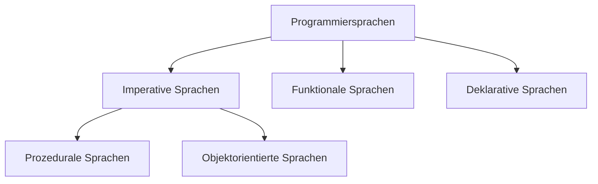

# Python

## Erste Schritte

### Interactive

```powershell
python
```

Dort können wir unser ersten Programm `1+2` schreiben. Der Prompt kann mit `ctrl+D` bzw. `ctrl+Z` unter Windows sowie dem Befehl exit() beendet werden.

### Direkt

```powershell
python -c "print('Hello World')"
```

### Skript starten

```powershell
python helloworld.py
```

## Allgemeine Syntax

### Rechenoperationen

Es gibt die Rechenoperatoren: `+`,  `-`,  `*`,  `/`,  `%` (Modulo),  `**`, (Potenz), `//` (Ganzzahldivision)

1. Was genau macht die Ganzzahldivision `\\`?
2. Gilt die Regel Punkt vor Strich?
3. Was passiert, wenn Sie True zu einer Zahl addieren?
4. Was passiert, wenn Sie die Anzahl der Atome im Universum $10^{80}$ eingeben. Was würde bei Java oder Javascript passieren? Eine Vermutung genügt.
5. Prüfen Sie den Wert der Variablen `_`. Zu was dient sie?

### Variablen

In Python werden Variablen nicht explizit deklariert. Außerdem wird kein Typ angegeben. Eine Variable selbst hat auch keinen statischen Typ. Lediglich der Inhalt hat einen (dynamischen) Typ.

Eine Zuweisung geschieht analog zu Java.

```
höhe = 100
breite = 80
höhe * breite
```

Der (dynamische) Typ einer Variable kann mit der Funktion `type()` geprüft werden.

### Strings

Strings werden mit `"text"`  oder `'text'` angegeben.

1. Schreiben Sie den String `doesn't`.

2. Notieren Sie den String  `He doesn't like a 20" bicycle`. Benutzen Sie dazu den Escape-Character der Ihnen aus Java bekannt ist.

3. Sie können mit dreifachen Anführungsstrichen einen String aus mehreren Zeilen erzeugen. Aber wozu ist der `\`? 
	```
   """\
    () ()
    ('.')
   (") (")
   """
   ```
   
4. Können Sie Strings auch mit Zahlen multiplizieren? Wozu könnte das sinnvoll sein?

5. Extrahieren Sie den ersten Buchstaben eines Wortes wie folgt `Python[0]`. Welchen Typ hat ein Buchstabe in Python?

6. Geben Sie eine negative Zahl als Index an. Was passiert? Was würde in Java passieren. Welchen Vor- und Nachteil hat das Verhalten von Python gegenüber dem von Java?

7. Benutzen Sie die Funktion `len()` um die Länge eines Strings zu messen.

8. Wie funktioniert die Syntax `"Python"[1:3]`? Welchen Vorteil hat die vielleicht Gewöhnungsbedürftige Indizierung? Lassen Sie eine der beiden Zahlen weg.

9. Weisen Sie der Variablen `a` einen String zu. Versuchen Sie einen Buchstaben zu ändern. Entwickeln Sie einen Workaround.

### Listen und Tupel


## Einordnung und Abgrenzung

Python ist eine sehr flexible Sprache für Rapid Application Development. Viele würden sie als „schön“ bezeichnen.  

### Unterschiede von Python zu Javascript und Java 


| Aspekt               | Python              | Javascript         | Java                  |
| -------------------- | ------------------- | ------------------ | --------------------- |
| Typsystem            | Dynamisch Strikt    | Dynamisch schwach  | Statisch Strikt       |
| Immutable            | Ja                  | nein               | möglich               |
| Numerische Typen     | int, float, decimal | number             | int, long, double ... |
| Argumente            | strikt              | flexibel           | strikt                |
| Geordnete Daten      | List, Tupel         | Array              | Array, List           |
| Properties           | Descriptor Protocol | `get`-Syntax       | manuell               |
| Module               | Batteries Included  | Frameworks         | Batteries Included    |
| Objektorientierung   | möglich             | möglich            | forciert              |
|                      |                     |                    |                       |
| Blöcke               | Einrückung          | {}                 | {}                    |
| Befehlsende          | Zeilenende          | ; (automatisch)    | ;                     |
|                      |                     |                    |                       |
| Geschwindigkeit      | Langsam (Cpython)   | Schnell (Node)     | Schnell               |
| Vorinstalliert       | außer auf Windows   | Im Browser         | Auf Android           |
| Web-Einsatz          | Backend             | Frondend + Backend | Backend               |
| Scientific Computing | Ja (Numpy)          | Nein               | Nein                  |
|                      |                     |                    |                       |



Python kann sowohl prozedural als auch objektorientiert verwendet werden und enthält viele Aspekte der Funktionalen und Deklarativen Programmierung. 

> The reason it has been so successful with Data Processing and Machine Learning tasks is that many of the libraries have adopted API's where you declare the operations you want to perform, and the library executes those declarations in an efficient manner in a lower level language. This leads to the best of both worlds, code thats easy to write in Python that runs as fast as code written in C++.
> (https://www.benfrederickson.com/python-as-a-declarative-programming-language/)

## Dateien öffnen
```python
f = open("demofile2.txt", "a")
f.write("Now the file has more content!")
f.close()

#open and read the file after the appending:
f = open("demofile2.txt", "r")
print(f.read())
```
## Module
### Module nutzen am Beispiel von

## Stystemadministration mit Python

### Starten von Python

Unter Unix kann mit einem Shebang `#!/usr/bin/env python3` kenntlich gemacht werden, dass es sich bei einer Datei um ein Python skript handelt. Somit reduziert sich der Aufruf zu `helloworld.py` wobei die Dateiendung weggelassen werden kann.

In Windows gibt es keine Shebangs. Dort kann man ein Batchfile wie folgt erstellen. 

```powershell
@ECHO OFF
python C:\PathToPythonFile\somescript.py
```

 So eine Datei in einem Verzeichnis, auf das die Pfadvariable zeigt kann genutzt werden um die Terminals `cmd`oder `powershell` um Befehle zu erweitern.


## Quellen
Vertleich von Python und Javascript: https://www.educba.com/python-vs-javascript/
